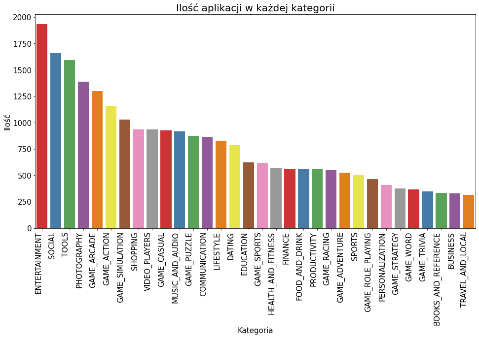
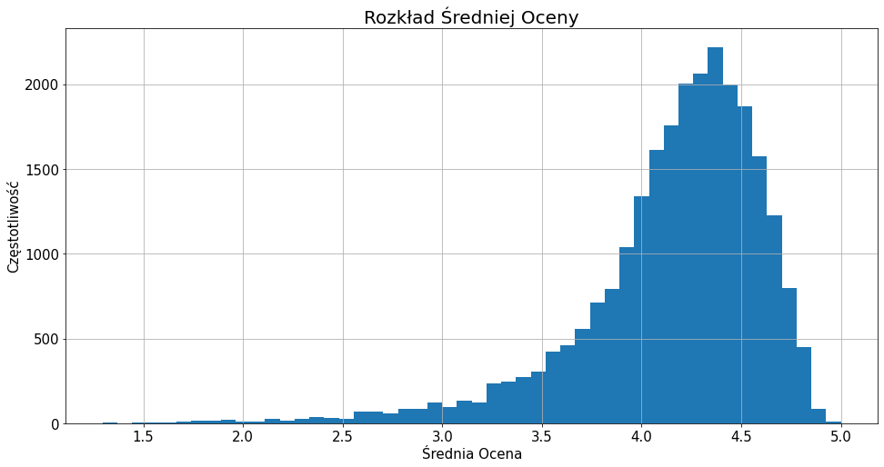
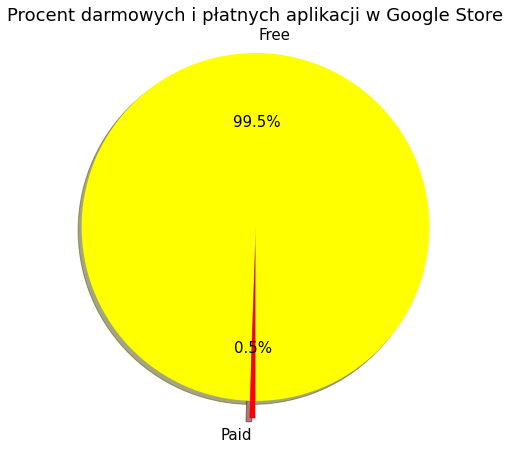
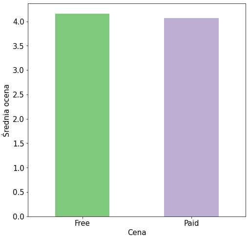
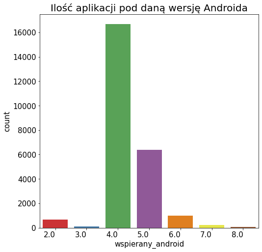
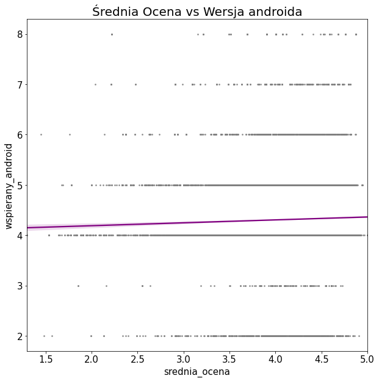
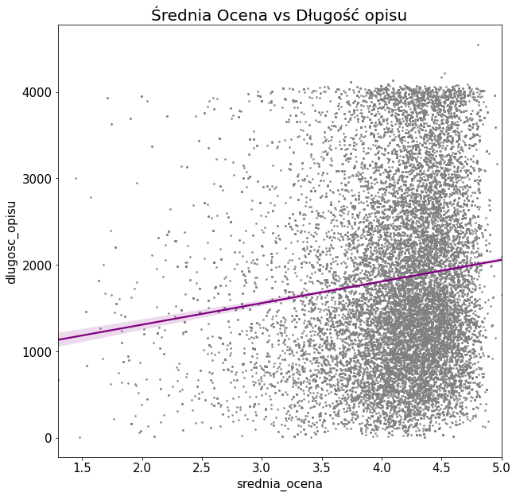
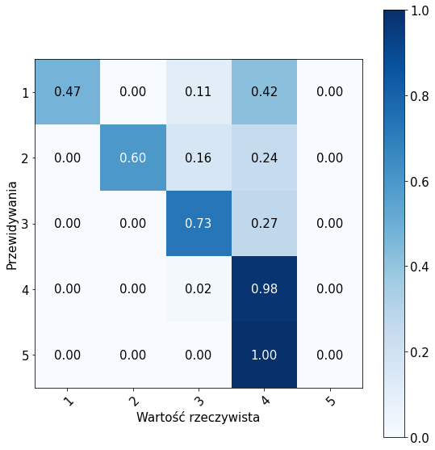
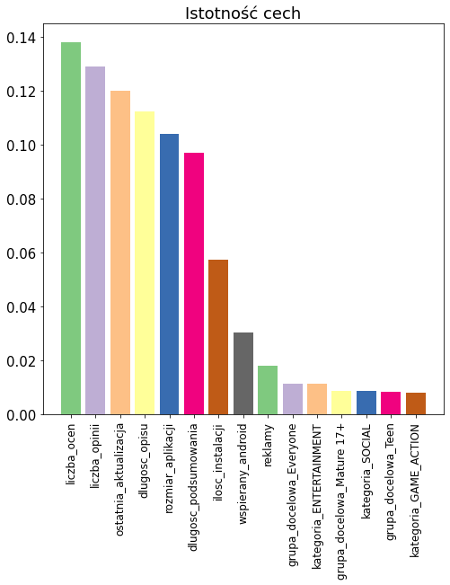

```python
import numpy as np
from sklearn.metrics import confusion_matrix
from sklearn.neighbors import KNeighborsClassifier
from sklearn.preprocessing import MinMaxScaler
from sklearn.svm import SVC
from sklearn.tree import DecisionTreeClassifier
from sklearn.ensemble import RandomForestClassifier
import pandas as pd
from sklearn.model_selection import train_test_split
import seaborn as sns
from pylab import rcParams
import matplotlib.pyplot as plt
from matplotlib.cm import get_cmap

np.random.seed(0)
```

    /usr/local/lib/python3.6/dist-packages/statsmodels/tools/_testing.py:19: FutureWarning: pandas.util.testing is deprecated. Use the functions in the public API at pandas.testing instead.
      import pandas.util.testing as tm
    


```python
name = "Accent"
cmap = get_cmap(name)
colors = cmap.colors
rcParams['figure.figsize'] = 16, 8
rcParams.update({'font.size': 15})

def plot_rating_graph(data):
    data['srednia_ocena'].describe()
    g = sns.kdeplot(data['srednia_ocena'], color="Red", shade=True)
    g.set_xlabel("Średnia Ocena", size=15)
    g.set_ylabel("Częstotliwość", size=15)
    plt.title('Rozkład Średniej Oceny', size=20)
    plt.show()


def plot_rating_description_length_graph(data):
    plt.figure(figsize=(10, 10))
    sns.regplot(x="srednia_ocena", y="dlugosc_opisu", scatter_kws={"color": "grey", "s": 3},
                line_kws={"color": "purple"}, data=data)
    plt.title('Średnia Ocena vs Długość opisu', size=20)
    plt.show()


def plot_rating_android_version_graph(data):
    plt.figure(figsize=(10, 10))
    sns.regplot(x="srednia_ocena", y="wspierany_android", scatter_kws={"color": "grey", "s": 3},
                line_kws={"color": "purple"}, data=data)
    plt.title('Średnia Ocena vs Wersja androida', size=20)
    plt.show()


def plot_rating_graph(data):
    data['srednia_ocena'].hist(bins=50)
    plt.xlabel("Średnia Ocena", size=15)
    plt.ylabel("Częstotliwość", size=15)
    plt.title('Rozkład Średniej Oceny', size=20)
    plt.show()


def price_to_text(prices):
    if prices > 0.0:
        return 'Paid'
    else:
        return 'Free'


def plot_rating_price_graph(data):
    data = data.copy()
    data = data[['cena', 'srednia_ocena']]
    data['cena'] = data['cena'].map(price_to_text)
    average = data.groupby('cena').mean()
    average.plot.bar(color=colors, y='srednia_ocena', rot=0, legend=False)
    plt.xlabel('Cena')
    plt.ylabel('Średnia ocena')
    plt.show()


def plot_prices(data):
    prices = data['cena'].map(price_to_text).value_counts(sort=True)
    labels = prices.index
    colors = ["yellow", "red"]
    explode = (0.1, 0.0)
    rcParams['figure.figsize'] = 8, 8
    rcParams.update({'font.size': 15})
    plt.pie(prices, explode=explode, labels=labels, colors=colors,
            autopct='%1.1f%%', shadow=True, startangle=270, )
    plt.title('Procent darmowych i płatnych aplikacji w Google Store', size=18)
    plt.show()


def plot_supported_android(data):
    g = sns.countplot(x="wspierany_android", data=data, palette="Set1")
    g.set_xticklabels(g.get_xticklabels(), rotation=0, ha="right")
    plt.title('Ilość aplikacji pod daną wersję Androida', size=20)
    plt.show()


def plot_confusion_matrix(cm):
    cm = cm.astype('float') / cm.sum(axis=1)[:, np.newaxis]
    plt.figure()
    fig, ax = plt.subplots()
    im = ax.imshow(cm, interpolation='nearest', cmap=plt.cm.Blues)
    ax.figure.colorbar(im, ax=ax)
    ax.set(xticks=np.arange(cm.shape[1]), yticks=np.arange(cm.shape[0]),
           xticklabels=range(1, 6),
           yticklabels=range(1, 6),
           xlabel='Wartość rzeczywista',
           ylabel='Przewidywania')
    plt.setp(ax.get_xticklabels(), rotation=45, ha='right', rotation_mode='anchor')

    thresh = cm.max() / 2
    for i in range(cm.shape[0]):
        for j in range(cm.shape[1]):
            ax.text(j, i, format(cm[i, j], '.2f'), ha='center', va='center',
                    color='white' if cm[i, j] > thresh else 'black')

    fig.tight_layout()
    plt.show()


def plot_feature_importance(data, cls):
    top_n = 15
    importances = cls.feature_importances_
    indices = np.argsort(importances)[::-1]
    features_names = []
    for f in range(X.shape[1]):
        features_names.append(data.columns[indices[f]])
    plt.figure()
    plt.title("Istotność cech")
    plt.bar(features_names[:top_n], importances[indices][:top_n],
            color=colors, align="center")
    plt.xticks(range(top_n), features_names[:top_n], rotation=90, size=12)
    plt.show()


def plot_scores(scores, labels):
    plt.ylabel('Dokładność')
    bars = plt.bar(labels, scores, align="center", color=colors)
    for bar in bars:
        yval = round(bar.get_height(), 2)
        plt.text(bar.get_x() + 0.25, yval + .005, yval)
    plt.xticks(range(len(scores)), labels, rotation=90, size=12)
    plt.show()


def plot_categories_graph(data):
    g = sns.countplot(x="kategoria", data=data, order = data['kategoria'].value_counts().index, palette="Set1")
    g.set_xticklabels(g.get_xticklabels(), rotation=90, ha="right")
    g.set_xlabel("Kategoria", size=15)
    g.set_ylabel("Ilość", size=15)
    plt.title('Ilość aplikacji w każdej kategorii', size=20)
    plt.show()
```

```
{
  title: 'Google Translate',
  description: 'Translate between 103 languages by typing\r\n...' ,
  descriptionHTML: 'Translate between 103 languages by typing<br>...',
  summary: 'The world is closer than ever with over 100 languages',
  installs: '500,000,000+',
  minInstalls: 500000000,
  score: 4.482483,
  scoreText: '4.5',
  ratings: 6811669,
  reviews: 1614618,
  histogram: { '1': 370042, '2': 145558, '3': 375720, '4': 856865, '5': 5063481 },
  price: 0,
  free: true,
  currency: 'USD',
  priceText: 'Free',
  offersIAP: false,
  IAPRange: undefined,
  size: 'Varies with device',
  androidVersion: 'VARY',
  androidVersionText: 'Varies with device',
  developer: 'Google LLC',
  developerId: '5700313618786177705',
  developerEmail: 'translate-android-support@google.com',
  developerWebsite: 'http://support.google.com/translate',
  developerAddress: '1600 Amphitheatre Parkway, Mountain View 94043',
  privacyPolicy: 'http://www.google.com/policies/privacy/',
  developerInternalID: '5700313618786177705',
  genre: 'Tools',
  genreId: 'TOOLS',
  familyGenre: undefined,
  familyGenreId: undefined,
  icon: 'https://lh3.googleusercontent.com/ZrNeuKthBirZN7rrXPN1JmUbaG8ICy3kZSHt-WgSnREsJzo2txzCzjIoChlevMIQEA',
  headerImage: 'https://lh3.googleusercontent.com/e4Sfy0cOmqpike76V6N6n-tDVbtbmt6MxbnbkKBZ_7hPHZRfsCeZhMBZK8eFDoDa1Vf-',
  screenshots: [
    'https://lh3.googleusercontent.com/dar060xShkqnJjWC2j_EazWBpLo28X4IUWCYXZgS2iXes7W99LkpnrvIak6vz88xFQ',
    'https://lh3.googleusercontent.com/VnzidUTSWK_yhpNK0uqTSfpVgow5CsZOnBdN3hIpTxODdlZg1VH1K4fEiCrdUQEZCV0',
  ],
  video: undefined,
  videoImage: undefined,
  contentRating: 'Everyone',
  contentRatingDescription: undefined,
  adSupported: false,
  released: undefined,
  updated: 1576868577000,
  version: 'Varies with device',
  recentChanges: 'Improved offline translations with upgraded language downloads',
  comments: [],
  editorsChoice: true,
  appId: 'com.google.android.apps.translate',
  url: 'https://play.google.com/store/apps/details?id=com.google.android.apps.translate&hl=en&gl=us'
}
```


```python
classifiers = {
    'KNN': KNeighborsClassifier(15),
    'SVC': SVC(kernel='rbf'),
    'Decision Trees': DecisionTreeClassifier(),
    'Random Forest': RandomForestClassifier(n_estimators=300)
}

```


```python
df = pd.read_csv('scrapper/data.csv').drop('id', axis=1)
df.head()
```


<div>
<table border="1" class="dataframe">
  <thead>
    <tr style="text-align: right;">
      <th></th>
      <th>kategoria</th>
      <th>srednia_ocena</th>
      <th>liczba_opinii</th>
      <th>liczba_ocen</th>
      <th>rozmiar_aplikacji</th>
      <th>ilosc_instalacji</th>
      <th>grupa_docelowa</th>
      <th>cena</th>
      <th>ostatnia_aktualizacja</th>
      <th>wspierany_android</th>
      <th>reklamy</th>
      <th>polecana</th>
      <th>dlugosc_opisu</th>
      <th>dlugosc_podsumowania</th>
    </tr>
  </thead>
  <tbody>
    <tr>
      <th>0</th>
      <td>SOCIAL</td>
      <td>4.493460</td>
      <td>32867591.0</td>
      <td>100242737.0</td>
      <td>Varies with device</td>
      <td>1000000000</td>
      <td>Teen</td>
      <td>0.0</td>
      <td>1590593481000</td>
      <td>VARY</td>
      <td>True</td>
      <td>True</td>
      <td>920</td>
      <td>54</td>
    </tr>
    <tr>
      <th>1</th>
      <td>SOCIAL</td>
      <td>3.977075</td>
      <td>11579.0</td>
      <td>29068.0</td>
      <td>Varies with device</td>
      <td>5000000</td>
      <td>Teen</td>
      <td>0.0</td>
      <td>1590702595000</td>
      <td>VARY</td>
      <td>False</td>
      <td>False</td>
      <td>708</td>
      <td>24</td>
    </tr>
    <tr>
      <th>2</th>
      <td>SOCIAL</td>
      <td>4.058747</td>
      <td>2464.0</td>
      <td>7774.0</td>
      <td>Varies with device</td>
      <td>1000000</td>
      <td>Everyone</td>
      <td>0.0</td>
      <td>1590767252000</td>
      <td>5.0</td>
      <td>False</td>
      <td>False</td>
      <td>1034</td>
      <td>36</td>
    </tr>
    <tr>
      <th>3</th>
      <td>PHOTOGRAPHY</td>
      <td>4.491860</td>
      <td>156123.0</td>
      <td>901655.0</td>
      <td>Varies with device</td>
      <td>100000000</td>
      <td>Everyone</td>
      <td>0.0</td>
      <td>1540845891000</td>
      <td>VARY</td>
      <td>False</td>
      <td>False</td>
      <td>1456</td>
      <td>76</td>
    </tr>
    <tr>
      <th>4</th>
      <td>PHOTOGRAPHY</td>
      <td>4.425955</td>
      <td>414259.0</td>
      <td>1269062.0</td>
      <td>Varies with device</td>
      <td>100000000</td>
      <td>Everyone</td>
      <td>0.0</td>
      <td>1540845873000</td>
      <td>VARY</td>
      <td>False</td>
      <td>False</td>
      <td>944</td>
      <td>67</td>
    </tr>
  </tbody>
</table>
</div>


```python
def change_size(size):
    if 'M' in size:
        x = size[:-1]
        x = float(x) * 1024
        return x
    elif 'k' in size:
        x = size[:-1]
        x = float(x)
        return x
    else:
        return None


def change_supported_version(version):
    if version == 'VARY':
        return None
    if '.' in version:
        return int(version.split('.')[0])
    return None
```


```python
df['rozmiar_aplikacji'] = df['rozmiar_aplikacji'].map(change_size)
df['wspierany_android'] = df['wspierany_android'].map(change_supported_version)
df.head()
```


<div>
<table border="1" class="dataframe">
  <thead>
    <tr style="text-align: right;">
      <th></th>
      <th>kategoria</th>
      <th>srednia_ocena</th>
      <th>liczba_opinii</th>
      <th>liczba_ocen</th>
      <th>rozmiar_aplikacji</th>
      <th>ilosc_instalacji</th>
      <th>grupa_docelowa</th>
      <th>cena</th>
      <th>ostatnia_aktualizacja</th>
      <th>wspierany_android</th>
      <th>reklamy</th>
      <th>polecana</th>
      <th>dlugosc_opisu</th>
      <th>dlugosc_podsumowania</th>
    </tr>
  </thead>
  <tbody>
    <tr>
      <th>0</th>
      <td>SOCIAL</td>
      <td>4.493460</td>
      <td>32867591.0</td>
      <td>100242737.0</td>
      <td>NaN</td>
      <td>1000000000</td>
      <td>Teen</td>
      <td>0.0</td>
      <td>1590593481000</td>
      <td>NaN</td>
      <td>True</td>
      <td>True</td>
      <td>920</td>
      <td>54</td>
    </tr>
    <tr>
      <th>1</th>
      <td>SOCIAL</td>
      <td>3.977075</td>
      <td>11579.0</td>
      <td>29068.0</td>
      <td>NaN</td>
      <td>5000000</td>
      <td>Teen</td>
      <td>0.0</td>
      <td>1590702595000</td>
      <td>NaN</td>
      <td>False</td>
      <td>False</td>
      <td>708</td>
      <td>24</td>
    </tr>
    <tr>
      <th>2</th>
      <td>SOCIAL</td>
      <td>4.058747</td>
      <td>2464.0</td>
      <td>7774.0</td>
      <td>NaN</td>
      <td>1000000</td>
      <td>Everyone</td>
      <td>0.0</td>
      <td>1590767252000</td>
      <td>5.0</td>
      <td>False</td>
      <td>False</td>
      <td>1034</td>
      <td>36</td>
    </tr>
    <tr>
      <th>3</th>
      <td>PHOTOGRAPHY</td>
      <td>4.491860</td>
      <td>156123.0</td>
      <td>901655.0</td>
      <td>NaN</td>
      <td>100000000</td>
      <td>Everyone</td>
      <td>0.0</td>
      <td>1540845891000</td>
      <td>NaN</td>
      <td>False</td>
      <td>False</td>
      <td>1456</td>
      <td>76</td>
    </tr>
    <tr>
      <th>4</th>
      <td>PHOTOGRAPHY</td>
      <td>4.425955</td>
      <td>414259.0</td>
      <td>1269062.0</td>
      <td>NaN</td>
      <td>100000000</td>
      <td>Everyone</td>
      <td>0.0</td>
      <td>1540845873000</td>
      <td>NaN</td>
      <td>False</td>
      <td>False</td>
      <td>944</td>
      <td>67</td>
    </tr>
  </tbody>
</table>
</div>


```python
df.dropna(inplace=True)

df = df.groupby('kategoria').filter(lambda x: len(x) > 300)
df = df.groupby('grupa_docelowa').filter(lambda x: len(x) > 50)
df = df.groupby('wspierany_android').filter(lambda x: len(x) > 50)

df.head()
```


<div>
<table border="1" class="dataframe">
  <thead>
    <tr style="text-align: right;">
      <th></th>
      <th>kategoria</th>
      <th>srednia_ocena</th>
      <th>liczba_opinii</th>
      <th>liczba_ocen</th>
      <th>rozmiar_aplikacji</th>
      <th>ilosc_instalacji</th>
      <th>grupa_docelowa</th>
      <th>cena</th>
      <th>ostatnia_aktualizacja</th>
      <th>wspierany_android</th>
      <th>reklamy</th>
      <th>polecana</th>
      <th>dlugosc_opisu</th>
      <th>dlugosc_podsumowania</th>
    </tr>
  </thead>
  <tbody>
    <tr>
      <th>5</th>
      <td>SOCIAL</td>
      <td>3.769916</td>
      <td>32232.0</td>
      <td>107362.0</td>
      <td>5734.4</td>
      <td>1000000</td>
      <td>Everyone</td>
      <td>0.0</td>
      <td>1590091017000</td>
      <td>5.0</td>
      <td>True</td>
      <td>False</td>
      <td>1560</td>
      <td>80</td>
    </tr>
    <tr>
      <th>6</th>
      <td>VIDEO_PLAYERS</td>
      <td>4.815613</td>
      <td>280637.0</td>
      <td>734066.0</td>
      <td>6963.2</td>
      <td>50000000</td>
      <td>Everyone</td>
      <td>0.0</td>
      <td>1590663537000</td>
      <td>5.0</td>
      <td>True</td>
      <td>False</td>
      <td>1603</td>
      <td>80</td>
    </tr>
    <tr>
      <th>7</th>
      <td>VIDEO_PLAYERS</td>
      <td>4.798943</td>
      <td>236911.0</td>
      <td>605590.0</td>
      <td>6860.8</td>
      <td>10000000</td>
      <td>Everyone</td>
      <td>0.0</td>
      <td>1590835522000</td>
      <td>4.0</td>
      <td>True</td>
      <td>False</td>
      <td>3749</td>
      <td>77</td>
    </tr>
    <tr>
      <th>8</th>
      <td>SOCIAL</td>
      <td>4.077390</td>
      <td>2925.0</td>
      <td>6668.0</td>
      <td>8704.0</td>
      <td>500000</td>
      <td>Teen</td>
      <td>0.0</td>
      <td>1587482309000</td>
      <td>5.0</td>
      <td>False</td>
      <td>False</td>
      <td>1461</td>
      <td>80</td>
    </tr>
    <tr>
      <th>9</th>
      <td>SOCIAL</td>
      <td>4.720475</td>
      <td>106454.0</td>
      <td>374057.0</td>
      <td>7782.4</td>
      <td>5000000</td>
      <td>Everyone</td>
      <td>0.0</td>
      <td>1586259901000</td>
      <td>5.0</td>
      <td>True</td>
      <td>False</td>
      <td>2479</td>
      <td>62</td>
    </tr>
  </tbody>
</table>
</div>


```python
plot_categories_graph(df)
```





```python
plot_rating_graph(df)

```





```python
plot_prices(df)
plot_rating_price_graph(df)
```








```python
plot_supported_android(df)
plot_rating_android_version_graph(df)
```








Wykres Regresji liniowej ilości znaków od średniej uzyskanej oceny przez aplikację.


```python
plot_rating_description_length_graph(df)

```





```python
df = pd.get_dummies(df, columns=['kategoria', 'grupa_docelowa'])
df.head()
```


<div>
<table border="1" class="dataframe">
  <thead>
    <tr style="text-align: right;">
      <th></th>
      <th>srednia_ocena</th>
      <th>liczba_opinii</th>
      <th>liczba_ocen</th>
      <th>rozmiar_aplikacji</th>
      <th>ilosc_instalacji</th>
      <th>cena</th>
      <th>ostatnia_aktualizacja</th>
      <th>wspierany_android</th>
      <th>reklamy</th>
      <th>polecana</th>
      <th>dlugosc_opisu</th>
      <th>dlugosc_podsumowania</th>
      <th>kategoria_BOOKS_AND_REFERENCE</th>
      <th>kategoria_BUSINESS</th>
      <th>kategoria_COMMUNICATION</th>
      <th>kategoria_DATING</th>
      <th>kategoria_EDUCATION</th>
      <th>kategoria_ENTERTAINMENT</th>
      <th>kategoria_FINANCE</th>
      <th>kategoria_FOOD_AND_DRINK</th>
      <th>kategoria_GAME_ACTION</th>
      <th>kategoria_GAME_ADVENTURE</th>
      <th>kategoria_GAME_ARCADE</th>
      <th>kategoria_GAME_CASUAL</th>
      <th>kategoria_GAME_PUZZLE</th>
      <th>kategoria_GAME_RACING</th>
      <th>kategoria_GAME_ROLE_PLAYING</th>
      <th>kategoria_GAME_SIMULATION</th>
      <th>kategoria_GAME_SPORTS</th>
      <th>kategoria_GAME_STRATEGY</th>
      <th>kategoria_GAME_TRIVIA</th>
      <th>kategoria_GAME_WORD</th>
      <th>kategoria_HEALTH_AND_FITNESS</th>
      <th>kategoria_LIFESTYLE</th>
      <th>kategoria_MUSIC_AND_AUDIO</th>
      <th>kategoria_PERSONALIZATION</th>
      <th>kategoria_PHOTOGRAPHY</th>
      <th>kategoria_PRODUCTIVITY</th>
      <th>kategoria_SHOPPING</th>
      <th>kategoria_SOCIAL</th>
      <th>kategoria_SPORTS</th>
      <th>kategoria_TOOLS</th>
      <th>kategoria_TRAVEL_AND_LOCAL</th>
      <th>kategoria_VIDEO_PLAYERS</th>
      <th>grupa_docelowa_Everyone</th>
      <th>grupa_docelowa_Everyone 10+</th>
      <th>grupa_docelowa_Mature 17+</th>
      <th>grupa_docelowa_Teen</th>
    </tr>
  </thead>
  <tbody>
    <tr>
      <th>5</th>
      <td>3.769916</td>
      <td>32232.0</td>
      <td>107362.0</td>
      <td>5734.4</td>
      <td>1000000</td>
      <td>0.0</td>
      <td>1590091017000</td>
      <td>5.0</td>
      <td>True</td>
      <td>False</td>
      <td>1560</td>
      <td>80</td>
      <td>0</td>
      <td>0</td>
      <td>0</td>
      <td>0</td>
      <td>0</td>
      <td>0</td>
      <td>0</td>
      <td>0</td>
      <td>0</td>
      <td>0</td>
      <td>0</td>
      <td>0</td>
      <td>0</td>
      <td>0</td>
      <td>0</td>
      <td>0</td>
      <td>0</td>
      <td>0</td>
      <td>0</td>
      <td>0</td>
      <td>0</td>
      <td>0</td>
      <td>0</td>
      <td>0</td>
      <td>0</td>
      <td>0</td>
      <td>0</td>
      <td>1</td>
      <td>0</td>
      <td>0</td>
      <td>0</td>
      <td>0</td>
      <td>1</td>
      <td>0</td>
      <td>0</td>
      <td>0</td>
    </tr>
    <tr>
      <th>6</th>
      <td>4.815613</td>
      <td>280637.0</td>
      <td>734066.0</td>
      <td>6963.2</td>
      <td>50000000</td>
      <td>0.0</td>
      <td>1590663537000</td>
      <td>5.0</td>
      <td>True</td>
      <td>False</td>
      <td>1603</td>
      <td>80</td>
      <td>0</td>
      <td>0</td>
      <td>0</td>
      <td>0</td>
      <td>0</td>
      <td>0</td>
      <td>0</td>
      <td>0</td>
      <td>0</td>
      <td>0</td>
      <td>0</td>
      <td>0</td>
      <td>0</td>
      <td>0</td>
      <td>0</td>
      <td>0</td>
      <td>0</td>
      <td>0</td>
      <td>0</td>
      <td>0</td>
      <td>0</td>
      <td>0</td>
      <td>0</td>
      <td>0</td>
      <td>0</td>
      <td>0</td>
      <td>0</td>
      <td>0</td>
      <td>0</td>
      <td>0</td>
      <td>0</td>
      <td>1</td>
      <td>1</td>
      <td>0</td>
      <td>0</td>
      <td>0</td>
    </tr>
    <tr>
      <th>7</th>
      <td>4.798943</td>
      <td>236911.0</td>
      <td>605590.0</td>
      <td>6860.8</td>
      <td>10000000</td>
      <td>0.0</td>
      <td>1590835522000</td>
      <td>4.0</td>
      <td>True</td>
      <td>False</td>
      <td>3749</td>
      <td>77</td>
      <td>0</td>
      <td>0</td>
      <td>0</td>
      <td>0</td>
      <td>0</td>
      <td>0</td>
      <td>0</td>
      <td>0</td>
      <td>0</td>
      <td>0</td>
      <td>0</td>
      <td>0</td>
      <td>0</td>
      <td>0</td>
      <td>0</td>
      <td>0</td>
      <td>0</td>
      <td>0</td>
      <td>0</td>
      <td>0</td>
      <td>0</td>
      <td>0</td>
      <td>0</td>
      <td>0</td>
      <td>0</td>
      <td>0</td>
      <td>0</td>
      <td>0</td>
      <td>0</td>
      <td>0</td>
      <td>0</td>
      <td>1</td>
      <td>1</td>
      <td>0</td>
      <td>0</td>
      <td>0</td>
    </tr>
    <tr>
      <th>8</th>
      <td>4.077390</td>
      <td>2925.0</td>
      <td>6668.0</td>
      <td>8704.0</td>
      <td>500000</td>
      <td>0.0</td>
      <td>1587482309000</td>
      <td>5.0</td>
      <td>False</td>
      <td>False</td>
      <td>1461</td>
      <td>80</td>
      <td>0</td>
      <td>0</td>
      <td>0</td>
      <td>0</td>
      <td>0</td>
      <td>0</td>
      <td>0</td>
      <td>0</td>
      <td>0</td>
      <td>0</td>
      <td>0</td>
      <td>0</td>
      <td>0</td>
      <td>0</td>
      <td>0</td>
      <td>0</td>
      <td>0</td>
      <td>0</td>
      <td>0</td>
      <td>0</td>
      <td>0</td>
      <td>0</td>
      <td>0</td>
      <td>0</td>
      <td>0</td>
      <td>0</td>
      <td>0</td>
      <td>1</td>
      <td>0</td>
      <td>0</td>
      <td>0</td>
      <td>0</td>
      <td>0</td>
      <td>0</td>
      <td>0</td>
      <td>1</td>
    </tr>
    <tr>
      <th>9</th>
      <td>4.720475</td>
      <td>106454.0</td>
      <td>374057.0</td>
      <td>7782.4</td>
      <td>5000000</td>
      <td>0.0</td>
      <td>1586259901000</td>
      <td>5.0</td>
      <td>True</td>
      <td>False</td>
      <td>2479</td>
      <td>62</td>
      <td>0</td>
      <td>0</td>
      <td>0</td>
      <td>0</td>
      <td>0</td>
      <td>0</td>
      <td>0</td>
      <td>0</td>
      <td>0</td>
      <td>0</td>
      <td>0</td>
      <td>0</td>
      <td>0</td>
      <td>0</td>
      <td>0</td>
      <td>0</td>
      <td>0</td>
      <td>0</td>
      <td>0</td>
      <td>0</td>
      <td>0</td>
      <td>0</td>
      <td>0</td>
      <td>0</td>
      <td>0</td>
      <td>0</td>
      <td>0</td>
      <td>1</td>
      <td>0</td>
      <td>0</td>
      <td>0</td>
      <td>0</td>
      <td>1</td>
      <td>0</td>
      <td>0</td>
      <td>0</td>
    </tr>
  </tbody>
</table>
</div>


```python
scaler = MinMaxScaler()

y = df['srednia_ocena'].astype('int')
X = df.drop('srednia_ocena', axis=1)
X = pd.DataFrame(scaler.fit_transform(X), columns=X.columns)
X_train, X_test, y_train, y_test = train_test_split(X, y, test_size=0.2)
```


```python
scores = []
for name, classifier in classifiers.items():
    cls = classifier.fit(X_train, y_train)
    score = classifier.score(X_test, y_test)
    print("{}: {}".format(name, score))
    scores.append(score)
    cm = confusion_matrix(y_test, classifier.predict(X_test))
```

    KNN: 0.759649820931158
    SVC: 0.7224432948666932
    Decision Trees: 0.8706725029844807
    Random Forest: 0.9029048945483485
    


```python
plot_scores(scores, classifiers.keys())

```


```python
plot_confusion_matrix(cm)
unique, counts = np.unique(y_test, return_counts=True)
dict(zip(unique, counts))

```


    <Figure size 576x576 with 0 Axes>





    {1: 19, 2: 139, 3: 1235, 4: 3632, 5: 1}


```python
plot_feature_importance(X, cls)

```




